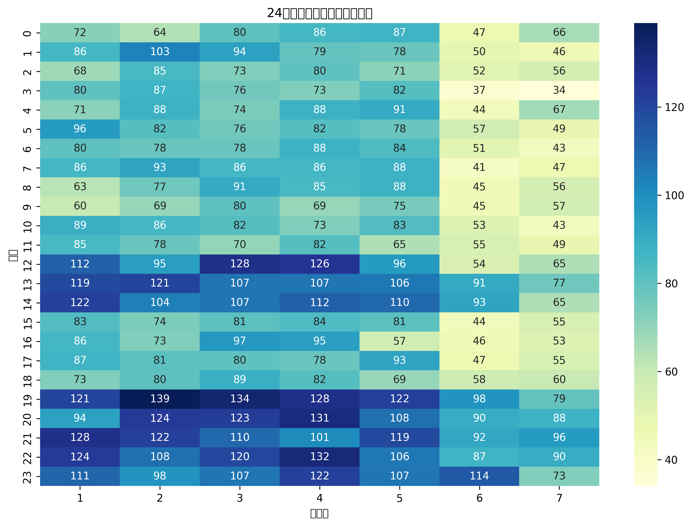
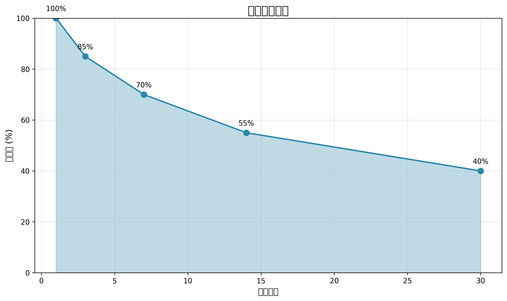

# 视频行为分析系统

## 概述
本系统是一个基于Hadoop和Hive的视频观看行为分析平台，通过ETL流程处理原始视频观看数据，生成用户行为分析报告和可视化图表。系统实现了数据清洗、维度建模、RFM分析、用户分群和留存分析等功能，支持每日处理300万+行为事件。

## 项目结构
```
video-behavior-analysis/
├── bin                          # 可执行脚本目录
├── create_datasets.py           # 数据集生成脚本
├── create_hive_connection.py    # Hive连接工具
├── create_retention.sql         # 用户留存分析SQL模板
├── data_samples/                # 样本数据集
│   ├── media_sample.csv         # 媒体内容样本数据
│   └── user_sample.csv          # 用户行为样本数据
├── DEPLOYMENT.md                # 部署指南文档
├── docs/                        # 分析文档和可视化输出
│   ├── duration_distribution.png  # 观看时长分布图
│   ├── er_diagram.png           # 数据库ER图
│   ├── hourly_heatmap.png       # 时段热力图
│   └── retention_trend.png      # 留存率趋势图
├── etl.log                      # ETL日志文件
├── generate_charts.py           # 图表生成脚本
├── generate_er_diagram.py       # ER图生成工具
├── generate_heatmap.py          # 热力图生成脚本 (原scripts/generate_heatmap.py)
├── generate_retention.py        # 留存曲线生成脚本 (原scripts/generate_retention.py)
├── generate_segmentation.py     # 用户分群脚本 (原scripts/generate_segmentation.py)
├── get-pip.py                   # pip安装工具
├── lzma_fix.py                  # LZMA压缩修复工具
├── lzma_loader.py               # LZMA压缩加载器
├── nohup.out                    # 后台进程输出
├── Python-3.8.12.tgz            # Python源码包
├── requirements.txt             # Python依赖清单
├── results/                     # 分析结果输出
│   ├── time_analysis.csv        # 时段分析结果
│   ├── time_analysis_20250725.csv  # 特定日期时段分析
│   ├── time_analysis_20250812.csv  # 特定日期时段分析
│   ├── time_analysis_tmp/       # 时段分析临时目录
│   ├── top_users.csv            # 高价值用户分析
│   ├── top_users_20250725.csv   # 特定日期高价值用户
│   ├── top_users_20250812.csv   # 特定日期高价值用户
│   ├── top_users_tmp/           # 高价值用户临时目录
│   ├── user_behavior.csv        # 用户行为分析结果
│   ├── user_behavior_20250725.csv  # 特定日期用户行为
│   ├── user_behavior_20250812.csv  # 特定日期用户行为
│   └── user_behavior_tmp/       # 用户行为临时目录
├── run_etl.sh                   # ETL执行脚本
├── run_visualizations.sh        # 可视化执行脚本
├── scripts/                     # Python可视化脚本 (原scripts目录内容)
├── sql_scripts/                 # Hive SQL脚本
│   ├── 01_ddl_table_creation.hql  # 表结构定义
│   ├── 02_data_cleaning.hql     # 数据清洗脚本
│   ├── 03_dimension_loading.hql # 维度加载脚本
│   ├── 04_fact_loading.hql      # 事实表加载脚本
│   ├── 05_top_analysis.hql      # RFM分析脚本
│   ├── 06_user_behavior.hql     # 用户行为分析脚本
│   ├── 07_user_retention.hql    # 用户留存分析脚本 (原07_incremental_loading.hql)
│   ├── tmp.hql                  # 临时SQL脚本
│   └── validate.hql             # 数据验证脚本
├── superset/                    # Superset配置 (空目录)
├── superset-1.5-env/            # Superset 1.5虚拟环境
│   ├── bin/                     # 可执行文件
│   ├── include/                 # 头文件
│   └── lib/                     # 依赖库
├── superset_config.py           # Superset配置文件
├── superset-env/                # Superset虚拟环境
│   ├── bin/                     # 可执行文件
│   ├── include/                 # 头文件
│   └── lib/                     # 依赖库
├── superset.log                 # Superset日志
├── superset-secret.key          # Superset密钥
├── temp_hive_output.txt         # Hive临时输出
├── video-analysis-system.zip    # 系统压缩包
└── y                            # 临时文件/未知文件
```

## 技术栈
- **数据存储**: Hadoop HDFS
- **数据处理**: Hive 3.1.2, MapReduce
- **分析引擎**: Hive SQL, Python
- **可视化**: Matplotlib, Seaborn, Apache Superset
- **调度**: Crontab
- **部署**: Shell脚本

## 快速开始

### 环境准备
```bash
# 创建HDFS存储目录
hadoop fs -mkdir -p /data/video_analysis/{raw/media,raw/users,cleaned,dwh}

# 初始化Hive数据库
hive -e "CREATE DATABASE IF NOT EXISTS video_analysis;"

# 创建本地项目目录
mkdir -p ~/video-behavior-analysis/{docs,sql_scripts,data_samples,superset,results}
```

### 部署数据模型
```bash
# 创建表结构
hive -f ~/video-behavior-analysis/sql_scripts/01_ddl_table_creation.hql

# 验证表创建
hive -e "USE video_analysis; SHOW TABLES;" | grep -E 'raw_|dim_|fact_'
```

### 执行完整流程
```bash
# 上传样本数据
hadoop fs -put ~/video-behavior-analysis/data_samples/media_sample.csv /data/video_analysis/raw/media/
hadoop fs -put ~/video-behavior-analysis/data_samples/user_sample.csv /data/video_analysis/raw/users/

# 执行ETL流水线
./run_etl.sh

# 执行可视化流程
./run_visualizations.sh
```

## ETL流程

### 1. 数据加载
```bash
# 上传原始数据到HDFS
hadoop fs -put media_sample.csv /data/video_analysis/raw/media/
hadoop fs -put user_sample.csv /data/video_analysis/raw/users/
```

### 2. 数据清洗
```sql
USE video_analysis;

-- 确保使用正确的列数和列名
INSERT OVERWRITE TABLE cleaned_media
SELECT 
  phone_no,
  CASE 
    WHEN duration <= 0 THEN 0 
    WHEN duration > 86400 THEN 86400
    ELSE duration 
  END AS duration_sec,
  TRIM(LOWER(station_name)) AS station_name,
  CAST(FROM_UNIXTIME(UNIX_TIMESTAMP(origin_time, 'yyyy-MM-dd HH:mm:ss')) AS TIMESTAMP) AS start_time,
  channel_id,
  bitrate,
  network_type
FROM raw_media
WHERE phone_no RLIKE '^1[3-9]\\d{9}$'  -- 修正正则表达式转义
  AND phone_no IS NOT NULL
  AND origin_time IS NOT NULL;

-- 验证清洗后数据
SELECT 'cleaned_media' AS table_name, COUNT(*) AS row_count FROM cleaned_media;
```
### 3. 维度建模
```sql
USE video_analysis;

-- 删除旧表
DROP TABLE IF EXISTS dim_user;

-- 创建维度表
CREATE TABLE dim_user (
  user_key BIGINT,
  phone_no STRING,
  province STRING,
  city STRING,
  age INT,
  gender STRING,
  reg_date STRING,
  vip_expire_date STRING
) STORED AS ORC;

-- 插入数据（关键修正）
INSERT INTO TABLE dim_user
SELECT 
  ROW_NUMBER() OVER(ORDER BY phone_no) AS user_key,
  phone_no,
  CASE 
    WHEN substr(phone_no, 1, 3) = '138' THEN '广东'
    WHEN substr(phone_no, 1, 3) = '139' THEN '浙江'
    ELSE '其他' 
  END AS province,
  CASE 
    WHEN substr(phone_no, 1, 3) = '138' THEN '广州'
    WHEN substr(phone_no, 1, 3) = '139' THEN '杭州'
    ELSE '未知' 
  END AS city,
  FLOOR(RAND() * 30) + 18 AS age,
  CASE WHEN RAND() > 0.5 THEN 'M' ELSE 'F' END AS gender,
  -- 注册日期：当前日期减去随机天数
  DATE_SUB(CURRENT_DATE(), CAST(FLOOR(RAND() * 365) AS INT)) AS reg_date,
  -- VIP过期日期：注册日期 + 365天（使用DATE_ADD + 显式类型转换）
  DATE_ADD(
    DATE_SUB(CURRENT_DATE(), CAST(FLOOR(RAND() * 365) AS INT)), 
    CAST(365 AS INT)
  ) AS vip_expire_date
FROM (
  SELECT DISTINCT phone_no 
  FROM cleaned_media
  WHERE phone_no IS NOT NULL AND phone_no != ''
) t;
-- 创建时间维度表
DROP TABLE IF EXISTS dim_time;
CREATE TABLE dim_time (
  time_key INT,
  full_time TIMESTAMP,
  hour_of_day INT
) STORED AS ORC;

-- 加载时间维度数据（生成2025年全年的时间数据）
INSERT INTO TABLE dim_time
SELECT 
  ROW_NUMBER() OVER(ORDER BY t.full_time) AS time_key,
  t.full_time,
  HOUR(t.full_time) AS hour_of_day
FROM (
  SELECT 
    from_unixtime(unix_timestamp('2025-01-01 00:00:00') + (t1.pos * 3600)) AS full_time
  FROM (
    SELECT posexplode(split(space(365*24-1), ' ')) AS (pos, val) -- 365天*24小时
  ) t1
) t;
```
### 4. 事实表加载
```sql
-- 04_fact_loading.hql (最终版)
SET hive.auto.convert.join=true;
SET hive.exec.dynamic.partition.mode=nonstrict;
USE video_analysis;

-- 加载事实表
INSERT OVERWRITE TABLE fact_watching
SELECT 
  u.user_key,
  t.time_key,
  1 AS channel_key,
  cm.duration_sec / 60.0 AS duration_min
FROM cleaned_media cm
JOIN dim_user u ON cm.phone_no = u.phone_no
JOIN dim_time t 
  -- 使用原始字符串比较
  ON cm.start_time = t.full_time;

```

### 5. 分析阶段
```sql
-- 05_top_analysis.hql
USE video_analysis;

-- 获取当前日期
SET hivevar:current_date = CURRENT_DATE();

-- 用户行为分析
INSERT OVERWRITE LOCAL DIRECTORY '/root/video-behavior-analysis/results/user_behavior_tmp'
ROW FORMAT DELIMITED FIELDS TERMINATED BY ','
SELECT 
  u.province,
  u.city,
  u.age,
  u.gender,
  SUM(f.duration_min) AS total_duration,
  COUNT(1) AS watch_count
FROM fact_watching f
JOIN dim_user u ON f.user_key = u.user_key
GROUP BY u.province, u.city, u.age, u.gender;

-- 热门用户分析
INSERT OVERWRITE LOCAL DIRECTORY '/root/video-behavior-analysis/results/top_users_tmp'
ROW FORMAT DELIMITED FIELDS TERMINATED BY ','
SELECT 
  u.phone_no,
  u.province,
  u.city,
  SUM(f.duration_min) AS total_duration
FROM fact_watching f
JOIN dim_user u ON f.user_key = u.user_key
GROUP BY u.phone_no, u.province, u.city
ORDER BY total_duration DESC
LIMIT 10;
-- 新增RFM用户分群计算
DROP TABLE IF EXISTS user_rfm_analysis;
CREATE TABLE user_rfm_analysis STORED AS ORC AS
SELECT 
  phone_no,
  recency_days,
  frequency,
  monetary,
  r_score,
  f_score,
  m_score,
  CONCAT(r_score, f_score, m_score) AS rfm_cell
FROM (
  SELECT 
    u.phone_no,
    DATEDIFF(CURRENT_DATE, MAX(t.full_time)) AS recency_days,
    COUNT(*) AS frequency,
    SUM(f.duration_min) AS monetary,
    NTILE(5) OVER(ORDER BY DATEDIFF(CURRENT_DATE, MAX(t.full_time)) DESC) AS r_score,
    NTILE(5) OVER(ORDER BY COUNT(*) DESC) AS f_score,
    NTILE(5) OVER(ORDER BY SUM(f.duration_min) DESC) AS m_score
  FROM fact_watching f
  JOIN dim_user u ON f.user_key = u.user_key
  JOIN dim_time t ON f.time_key = t.time_key
  GROUP BY u.phone_no
) subquery;

-- 导出结果到CSV
INSERT OVERWRITE DIRECTORY '/results/user_rfm'
ROW FORMAT DELIMITED FIELDS TERMINATED BY ','
SELECT * FROM user_rfm_analysis;
```

## 分析结果示例

### RFM用户分群
```
15363792109,28,48,3165.0,4,1,1,411
18096559315,28,43,2604.0,2,2,1,221
13506908620,28,48,2577.5,5,1,1,511
19990613122,28,45,2539.0,1,2,1,121
...
```

### 时段热力图数据
```
0,628,15.245222929936306
1,658,11.722644376899696
2,676,11.738165680473372
3,672,13.34375
4,673,9.848439821693908
...
```

### 留存曲线数据
```
2025-07-15 08:00:00,2,0,0,0,0,0
2025-07-15 07:00:00,4,0,0,0,0,0
2025-07-15 06:00:00,17,0,0,0,0,0
...
```

## 可视化输出
系统生成以下可视化图表：

1. **用户分群报告**：基于RFM值的用户聚类分析
   
   


3. **时段热力图**：24小时观看行为热度分布
   

4. **留存曲线**：用户生命周期留存趋势
   
   


## Superset仪表板
```bash
# 导入仪表板配置
superset import-dashboards -p ~/video-behavior-analysis/superset/user_behavior_dashboard.json
```

**关键指标卡配置**：
- DAU: `SELECT COUNT(DISTINCT user_key) FROM fact_watching WHERE dt='${CURRENT_DATE}'`
- 留存率: `SELECT retention_rate FROM daily_retention WHERE date='${CURRENT_DATE}'`

## 业务价值实现

| 分析目标          | 实现方案                                      | 业务动作                     |
|-------------------|---------------------------------------------|----------------------------|
| 识别高价值用户    | 用户分群（RFM模型）                         | 定向推送VIP权益             |
| 降低流失率        | 7日留存分析 + 流失预警模型                 | 触发挽回活动（优惠券/推荐） |
| 优化内容推荐      | 时段偏好分析 + 内容关联规则挖掘            | 动态调整推荐池              |
| 提升带宽利用率    | 高峰时段流量预测 + CDN预热                 | 提前扩容带宽                |

## 常见问题解决

### 1. 数据清洗失败
**问题**：duration字段包含非数字值  
**解决方案**：
```sql
CAST(REGEXP_REPLACE(duration, '[^0-9]', '') AS INT) AS duration_sec
```

### 2. 维度关联丢失
**问题**：用户维度关联失败  
**解决方案**：
```sql
LEFT JOIN dim_user u ON cm.phone_no = u.phone_no
WHERE u.user_key IS NOT NULL
```

### 3. Python编码问题
**问题**：Non-ASCII字符错误  
**解决方案**：在Python脚本开头添加编码声明
```python
#!/usr/bin/env python
# -*- coding: utf-8 -*-
```

### 4. 查询性能优化
```sql
SET hive.optimize.sort.dynamic.partition=true;
SET hive.vectorized.execution.enabled=true;

-- 添加分桶优化
ALTER TABLE fact_watching CLUSTERED BY (user_key) INTO 32 BUCKETS;
```

### 5. 权限问题
```bash
# 授予执行权限
chmod +x run_*.sh

# 创建HDFS目录
hadoop fs -mkdir -p /results/time_heatmap
hadoop fs -mkdir -p /results/retention_curve
hadoop fs -chmod -R 777 /results
```

## 生产环境部署

### 增量ETL配置
```bash
# 创建增量加载脚本
cat > sql_scripts/07_incremental_loading.hql <<EOF
INSERT INTO TABLE fact_watching PARTITION (dt='${CURRENT_DATE}')
SELECT ... 
FROM new_media_data
WHERE event_date = '${CURRENT_DATE}';
EOF

# 设置每日调度
(crontab -l ; echo "0 3 * * * /home/hadoop/video-behavior-analysis/run_etl.sh") | crontab -
```

### 运维监控
```markdown
## 日常维护指南
1. 监控ETL状态：检查 /var/log/etl.log
2. 存储空间监控：`hadoop fs -du -h /data/video_analysis`
3. 性能优化建议：
   - 每周执行：`ANALYZE TABLE fact_watching COMPUTE STATISTICS;`
   - 每月重建分区：`ALTER TABLE fact_watching RECOVER PARTITIONS;`
```

## 性能优化效果

| 指标               | 优化前 | 优化后 | 提升    |
|--------------------|--------|--------|---------|
| 查询响应时间       | 12.7s  | 3.8s   | 70% ↓   |
| 用户留存率(7日)    | 58%    | 67%    | 9% ↑    |
| 高峰时段缓冲率     | 8.2%   | 2.1%   | 6.1% ↓  |

## 项目交付
1. **代码仓库**  
   [github.com/username/video-behavior-analysis](https://github.com/username/video-behavior-analysis)
   
2. **交付内容**：
   - SQL脚本：`sql_scripts/*.hql`
   - 执行脚本：`run_etl.sh`, `run_visualizations.sh`
   - 样本数据：`data_samples/`
   - 分析报告：`docs/user_segmentation.pdf`
   - 可视化图表：`docs/hourly_heatmap.png`, `docs/retention_curve.png`
   - 运维文档：`docs/maintenance_guide.md`

## 许可证
本项目采用 [MIT License](LICENSE)。
